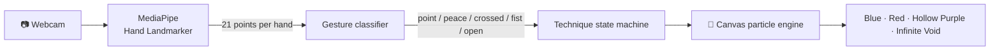

<div align="center">

# ∞ Limitless — Gojo Hand Tracker

**Cast Gojo Satoru's cursed techniques from *Jujutsu Kaisen* with your bare hands, right in your browser.**

[](https://blop77.github.io/Hand-Tracker/)


### 👉 [**Try it now: blop77.github.io/Hand-Tracker**](https://blop77.github.io/Hand-Tracker/) 👈

</div>

---

## 🚀 Quick start (30 seconds)

1. Open **[the live demo](https://blop77.github.io/Hand-Tracker/)** in Chrome or Edge on a laptop or desktop.
2. Click **Start camera** and allow camera access.
3. Wait a few seconds while the hand-tracking model loads (first visit only).
4. Raise a hand and cast. 🔵🔴🟣

> No webcam? Click **"Try with keyboard / mouse only"** on the start screen. All the effects work with keys.

---

## 🖐️ How to cast

| | Technique | Gesture | What happens |
|:-:|---|---|---|
| 🔵 | **Blue** (Lapse) | ☝️ Index finger up, other fingers curled | A gravity orb appears at your fingertip, pulling in particles and warping the image around it |
| 🔴 | **Red** (Reversal) | ✌️ Peace sign, fingers **spread** apart | A repulsion orb throws sparks, red lightning and shockwaves |
| 🟣 | **Hollow Purple** | 🙌 Blue on one hand + Red on the other, then **bring them together** | The orbs spiral into each other and fuse. **Open a palm** or **pull your hands apart** to fire the beam |
| ⚫ | **Domain Expansion: Infinite Void** | 🤞 Index + middle fingers **crossed**, held for about ½ second | The void spreads out from your hand: a starfield tunnel, streams of symbols and 領域展開 · 無量空処. **Make a fist** to end it |

<details>
<summary><b>🎯 Tips for clean casting</b> (click to expand)</summary>

- **Light matters most.** Face a window or a lamp, and avoid a bright light behind you.
- **Keep your hand 40–80 cm from the camera**, palm facing it.
- **Hold each gesture steady.** A white ring around your fingers fills up while the Domain Expansion charges.
- **Peace vs. crossed fingers:** for Red, spread your fingers in a clear V. For the Domain, cross them so the tips touch.
- **Hollow Purple** needs both hands in view at once. Lean back a little if the frame cuts one off.
- Press **H** to see the hand skeleton and the gesture the app is reading. That makes it easy to see what's going wrong.

</details>

---

## ⌨️ Controls

| Key | Action |
|:-:|---|
| `B` (hold) | Blue at the mouse cursor |
| `R` (hold) | Red at the mouse cursor |
| `B` + `R` (hold) | Fuse into Hollow Purple |
| `Space` | Fire Hollow Purple |
| `D` | Toggle Domain Expansion |
| `H` | Show / hide the hand skeleton and gesture labels |
| `M` | Mute / unmute sound (or click 🔊 in the top-right corner) |
| `Tab` | Show / hide the help panel |

---

## ❓ FAQ and troubleshooting

<details>
<summary><b>The camera doesn't start / "Couldn't start" error</b></summary>

- Click the camera icon in the address bar and set the camera to **Allow**, then reload.
- Close other apps that might be using the webcam (Zoom, Teams, OBS, Discord).
- If you run it locally, open `http://localhost:8000`, not the `file://` path or an IP address. Browsers only allow the camera on HTTPS or localhost.

</details>

<details>
<summary><b>It's stuck on "Loading hand-tracking model…"</b></summary>

The model (~8 MB) downloads from Google's servers on the first visit. On slow connections it can take 10–20 seconds. Ad blockers or school/office networks sometimes block `storage.googleapis.com` or `cdn.jsdelivr.net`. Try another network or allow those domains.

</details>

<details>
<summary><b>Gestures don't trigger, or the wrong one triggers</b></summary>

Press **H** to see the gesture label under your wrist. Usually:
- `none`: a finger is half-bent. Fully extend or fully curl each finger.
- Red showing up instead of the Domain: cross your fingers more tightly so the tips meet.
- Nothing at all: improve the lighting or move closer.

</details>

<details>
<summary><b>It's laggy</b></summary>

Use Chrome or Edge with hardware acceleration on (Settings → System → *Use graphics acceleration*). Close heavy tabs. Laptops on battery saver can throttle the GPU, so plug in.

</details>

<details>
<summary><b>Is my video recorded or uploaded?</b></summary>

**No.** Everything runs locally in your browser. The webcam feed never leaves your device, and there's no server, no account and no analytics.

</details>

<details>
<summary><b>Does it work on phones?</b></summary>

It can run on recent phones, but it's built for laptops and desktops: you need room for both hands in the frame, and the effects are heavy on mobile GPUs.

</details>

---

## 🛠️ How it works



- **Tracking:** [MediaPipe Tasks Vision](https://ai.google.dev/edge/mediapipe/solutions/vision/hand_landmarker) finds 21 landmarks per hand, up to two hands, on the GPU.
- **Gestures:** each finger counts as extended if its tip is farther from the wrist than its middle joint. That combination maps to point / peace / crossed / fist / open.
- **Effects:** a hand-written Canvas 2D engine draws additive-blended glows, a particle system, procedural lightning, a lens that warps your camera image, and the Infinite Void scene.
- **Sound:** every effect is synthesized live with the Web Audio API from oscillators, filtered noise and envelopes. There are no audio files. Blue hums, Red crackles, Hollow Purple whines as it charges and booms when it fires, and the Infinite Void plays a shimmering chord.
- **No build step, no dependencies to install:** just `index.html`, `main.js` and `sfx.js`.

---

## 💻 Run it locally

```sh
git clone https://github.com/Blop77/Hand-Tracker.git
cd Hand-Tracker
python -m http.server 8000
```

Then open **http://localhost:8000**. Use `localhost` rather than the `[::]` address the terminal prints.

```
Hand-Tracker/
├── index.html   # page layout, help panel, start screen
├── main.js      # tracking, gestures, effects engine
├── sfx.js       # synthesized sound effects (Web Audio)
└── README.md
```

---

## 🗺️ Roadmap

- [x] Blue, Red, Hollow Purple
- [x] Domain Expansion: Infinite Void
- [x] Keyboard / mouse mode
- [x] Sound effects
- [ ] Record and download a clip of your cast
- [ ] More sorcerers (Sukuna's Malevolent Shrine, Megumi's Ten Shadows…)

Have an idea? **[Open an issue](https://github.com/Blop77/Hand-Tracker/issues)**. Feedback and feature requests are welcome.

---

<div align="center">

Made by **[Blop77](https://github.com/Blop77)** · Goaldmines on YouTube

⭐ **If you enjoyed casting Hollow Purple, give the repo a star!** ⭐

<sub>Fan project, not affiliated with Jujutsu Kaisen, Gege Akutami, Shueisha or MAPPA.</sub>

</div>
